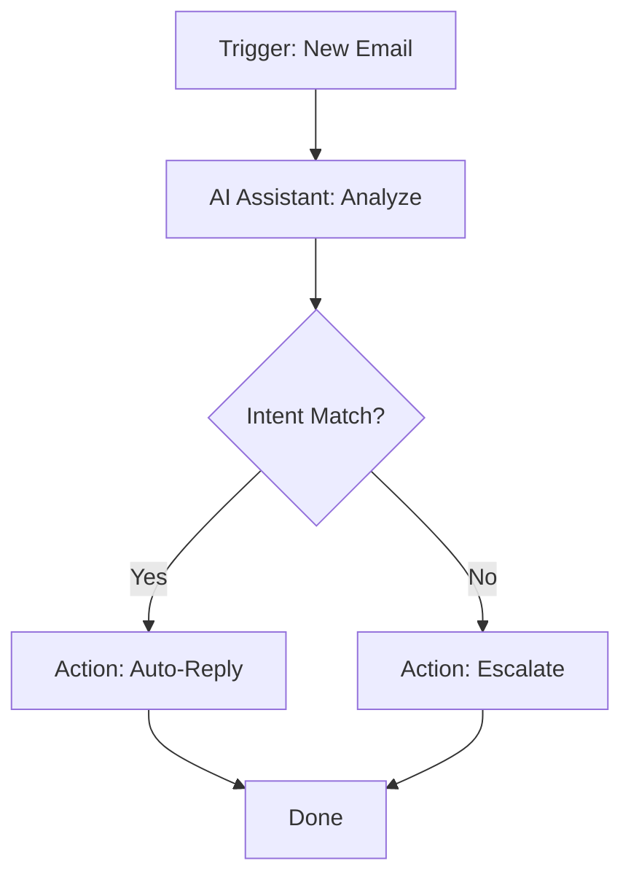

## Overview

Unitalk AI lets you customize assistants from the marketplace, connect your preferred AI models, and build automations that fit your workflow. Start by exploring ready-made assistants, then integrate external models like OpenAI or Anthropic, and finally chain them into powerful automations for tasks such as email responses or data processing.

<Callout kind="tip">
  Begin with marketplace assistants for quick wins, then customize as your needs grow.
</Callout>

## Explore the Marketplace

Browse the Unitalk marketplace to find pre-built AI assistants for common tasks. Each assistant comes with customizable prompts and integrations.

<Columns cols={3}>
  <Card title="Email Responder" icon="mail" href="/marketplace/email-responder">
    Automate customer support replies with context-aware responses.
  </Card>
  <Card title="Content Generator" icon="edit-3" href="/marketplace/content-gen">
    Create blog posts, social media, and marketing copy in seconds.
  </Card>
  <Card title="Data Analyst" icon="bar-chart-3" href="/marketplace/data-analyst">
    Analyze spreadsheets and generate insights from your data.
  </Card>
</Columns>

To customize an assistant, select it and edit its prompt template in the dashboard.

## Connect External AI Models

Link your own AI providers to use models beyond Unitalk's defaults. This unlocks access to GPT-4, Claude, or custom fine-tuned models.

<Steps>
  <Step title="Get API Credentials" icon="key">
    Obtain your API key from the provider dashboard. For OpenAI, visit platform.openai.com/api-keys.
  </Step>
  <Step title="Add to Unitalk" icon="settings">
    Navigate to Settings > AI Models in your Unitalk dashboard.
  </Step>
  <Step title="Configure Provider" icon="plug">
    Enter the details using the format below.
  </Step>
</Steps>

Use this configuration structure:

<CodeGroup tabs="JSON,Env Vars">
  ```json
  {
    "provider": "openai",
    "apiKey": "sk-proj-your-openai-key-here",
    "model": "gpt-4o-mini",
    "baseUrl": "https://api.openai.com/v1"
  }
  ```
  ```bash
  OPENAI_API_KEY=sk-proj-your-openai-key-here
  OPENAI_MODEL=gpt-4o-mini
  OPENAI_BASE_URL=https://api.openai.com/v1
  ```
</CodeGroup>

<Callout kind="alert">
  Store keys securely—Unitalk encrypts them at rest, but never share them publicly.
</Callout>

## Set Up Automation Workflows

Automations connect triggers, assistants, and actions. For example, trigger on new emails, process with an AI assistant, and send a Slack notification.

<Tabs>
  <Tab title="Email Trigger" icon="mail">
    <Steps>
      <Step title="Select Trigger">
        Choose "New Email" from Gmail or Outlook.
      </Step>
      <Step title="Add Assistant">
        Pick your customized Email Responder.
      </Step>
      <Step title="Set Action">
        Route reply to inbox or forward to Slack.
      </Step>
    </Steps>
  </Tab>
  <Tab title="Webhook Trigger" icon="zap">
    Use incoming webhooks for custom integrations.
    
    ```javascript
    // Example webhook payload
    fetch('https://api.unitalk.ai/webhook/your-id', {
      method: 'POST',
      headers: { 'Content-Type': 'application/json' },
      body: JSON.stringify({
        event: 'user_signup',
        userId: '12345',
        email: 'user@example.com'
      })
    });
    ```
  </Tab>
</Tabs>

Here's a simple workflow diagram:



## Advanced Configuration

<Expandable title="Custom Prompt Variables" default-open="false">

Inject dynamic data into prompts using variables like `{user_name}` or `{email_subject}`. Reference them in your assistant's template:

```
Respond to {user_name} about {email_subject}. Keep it under 200 words.
```

Test thoroughly to ensure variables resolve correctly.

</Expandable>

Your configurations sync across teams, so changes apply instantly. Monitor usage in the dashboard to optimize costs and performance.