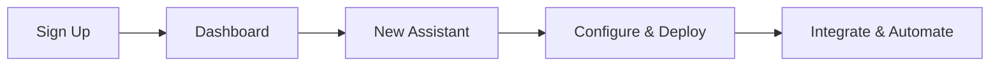

## Create Your Account

Sign up for Unitalk in under a minute to access AI models and the assistant marketplace. You need only an email address and password.

<Steps>
  <Step title="Visit Unitalk" icon="globe">
    Go to [unitalk.ai](https://unitalk.ai) and click **Sign Up**.
  </Step>
  <Step title="Enter Details" icon="user">
    Provide your email, create a strong password, and verify your account via the confirmation email.
  </Step>
  <Step title="Log In" icon="log-in">
    Return to the login page, enter your credentials, and access your dashboard.
  </Step>
</Steps>

<Callout kind="tip">
  Enable two-factor authentication immediately after login for added security.
</Callout>

## Explore the Dashboard

The Unitalk dashboard centralizes your AI assistants, models, and automations. Key sections include Assistants, Marketplace, Integrations, and Analytics.

<Columns cols={3}>
  <Card title="Assistants" icon="bot" href="/docs/assistants">
    Manage and deploy your custom AI assistants.
  </Card>
  <Card title="Marketplace" icon="shopping-bag" href="/docs/marketplace">
    Browse and customize pre-built AI tools.
  </Card>
  <Card title="Integrations" icon="plug" href="/docs/integrations">
    Connect to apps like Slack, Zapier, and Google Workspace.
  </Card>
</Columns>

## Build Your First AI Assistant

Create a simple customer support assistant using the no-code builder or API. This example automates responses for common queries.

<Tabs>
  <Tab title="No-Code Builder" icon="edit-3">
    <Steps>
      <Step title="New Assistant" icon="plus">
        Click **New Assistant** on the dashboard, name it `SupportBot`, and select `GPT-4o` as the base model.
      </Step>
      <Step title="Add Instructions" icon="file-text">
        Enter: "You are a helpful support agent for Unitalk users. Respond concisely and offer solutions."
      </Step>
      <Step title="Test & Deploy" icon="play">
        Test in the preview pane, then click **Deploy** to make it live.
      </Step>
    </Steps>
  </Tab>
  <Tab title="API Configuration" icon="code">
    Use the API to create programmatically.

    <CodeGroup tabs="JavaScript,cURL">
      ```javascript
      const response = await fetch('https://api.unitalk.ai/v1/assistants', {
        method: 'POST',
        headers: {
          'Authorization': `Bearer ${process.env.UNITALK_API_KEY}`,
          'Content-Type': 'application/json'
        },
        body: JSON.stringify({
          name: 'SupportBot',
          model: 'gpt-4o',
          instructions: 'You are a helpful support agent for Unitalk users. Respond concisely and offer solutions.'
        })
      });
      const assistant = await response.json();
      console.log(assistant.id);
      ```

      ```bash
      curl -X POST https://api.unitalk.ai/v1/assistants \
        -H "Authorization: Bearer $UNITALK_API_KEY" \
        -H "Content-Type: application/json" \
        -d '{
          "name": "SupportBot",
          "model": "gpt-4o",
          "instructions": "You are a helpful support agent for Unitalk users. Respond concisely and offer solutions."
        }'
      ```
    </CodeGroup>
  </Tab>
</Tabs>

<Callout kind="success">
  Your assistant is now ready! Test it via the chat interface or integrate it into your workflows.
</Callout>

## Next Steps

<Expandable title="Customize Further" default-open="false">
  Explore advanced features like custom knowledge bases and multi-model routing in the [Assistants documentation](/docs/assistants).
</Expandable>



This quickstart equips you to start automating with Unitalk. Dive deeper into specific features next.